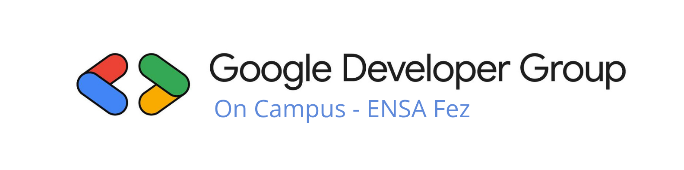
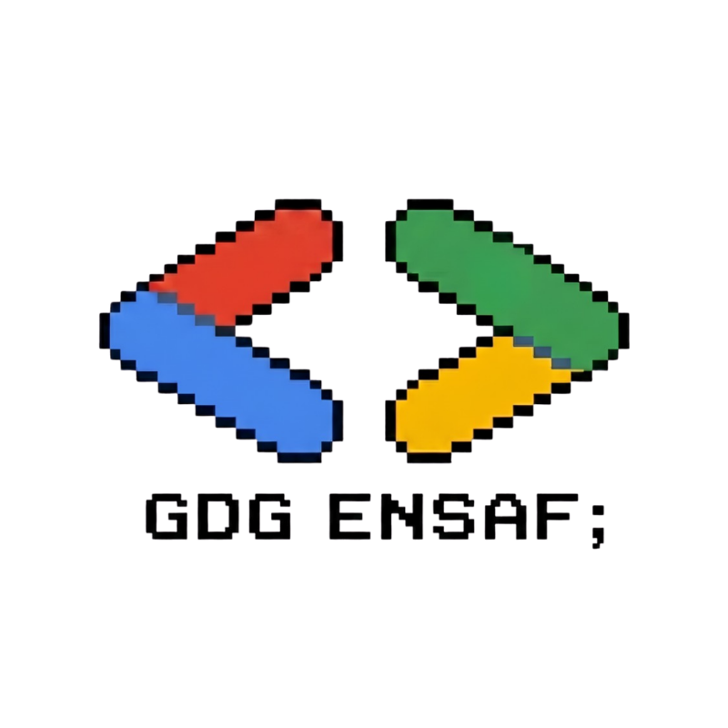

<div align="center">

  <!-- Banner -->
  

  <h1>Google Developer Groups on Campus ENSA Fez</h1>
  <!-- Logo -->
  
  <p><em>Bridging the gap between academic theory and industry practice.</em></p>

  <p align="center">
    <a href="#about">About Us</a> •
    <a href="#activities">What We Do</a> •
    <a href="#tracks">Technical Tracks</a> •
    <a href="#impact">Impact</a> •
    <a href="#tech-stack">Website Tech Stack</a> •
    <a href="#connect">Connect</a>
  </p>

  <p align="center">
    
    
    
  </p>

</div>

---

<a id="about"></a>
## 📌 About the Club

**Google Developer Group (GDG) on Campus - ENSA Fez** is a student-led developer community supported by Google Developers. Our mission is to provide engineering students with a collaborative environment to learn emerging technologies, build practical software solutions, and grow alongside passionate peers.

Whether you are writing your first line of code or architecting complex systems, our chapter is an open, inclusive space for all skill levels.

---

<a id="activities"></a>
## 🎯 What We Do

We organize dynamic, practice-oriented activities throughout the academic year:

* 💻 **Hackathons & Coding Competitions:** Collaborative problem-solving events where student teams build prototypes and software projects under time constraints.
* 🚩 **Capture The Flag (CTF) Challenges:** Practical cybersecurity competitions tackling reverse engineering, cryptography, web exploitation, and forensics.
* 🛠️ **Hands-on Workshops & Masterclasses:** Step-by-step technical sessions led by students, alumni, and industry professionals.
* 🎙️ **Tech Talks & Community Events:** In-depth talks covering industry trends, open-source practices, and career paths in technology.

---

<a id="tracks"></a>
## 🚀 Technical Tracks

Our activities and learning pathways revolve around six key pillars:

| Domain | Focus Areas |
| :--- | :--- |
| **🤖 Artificial Intelligence & ML** | Deep learning, LLMs, computer vision, natural language processing, model deployment. |
| **📊 Data Science & Analytics** | Data pipelines, visualization, feature engineering, statistical analysis. |
| **☁️ Cloud Computing** | Google Cloud Platform (GCP), cloud architecture, serverless systems, microservices. |
| **⚙️ DevOps & Site Reliability** | Docker containerization, CI/CD pipelines, automation, infrastructure basics. |
| **💻 Software & Mobile Engineering** | Full-stack web development, Flutter mobile apps, RESTful APIs, distributed systems. |
| **🔒 Cybersecurity** | System security, defensive engineering, secure coding, web security, CTFs. |

---

<a id="impact"></a>
## 🎓 How We Help Students

* **Practical Experience:** Transition from academic coursework to modern developer tooling, Git workflows, and production practices.
* **Portfolio Development:** Build open-source projects that can be demonstrated on resumes and GitHub profiles.
* **Peer & Industry Network:** Connect with fellow engineering students, alumni, tech leads, and Google Developer Experts (GDEs).
* **Leadership & Soft Skills:** Gain public speaking, technical writing, and team management experience by leading workshops and organizing events.

---

<a id="tech-stack"></a>
## 🛠️ Website Tech Stack & Getting Started

This repository houses the official portal and social hub of GDG on Campus ENSA Fez.

* **Frontend:** React 19 + TypeScript + Vite
* **Styling:** Tailwind CSS + Glassmorphism + Custom Floating Glow Animations
* **Visuals:** WebGL Mesh Drift Shader Background

### Development Setup

```bash
# Clone the repository
git clone https://github.com/gdgoc-ensaf/website.git

# Install dependencies
npm install

# Start development server
npm run dev
```

---

<a id="connect"></a>
## 🤝 Connect & Get Involved

Join our chapter, contribute to our repositories, or attend our upcoming sessions:

* 🌐 **Discord:** [discord.gg/AhzcJ337Q](https://discord.gg/AhzcJ337Q)
* 💼 **LinkedIn:** [GDG on Campus ENSA Fez](https://www.linkedin.com/in/marwane-gdg-on-campus-ensa-fez-77056b437/)
* 💬 **WhatsApp:** [Join Community Chat](https://chat.whatsapp.com/InjXKWptVBr0FKgtomo5Nb)
* 📸 **Instagram:** [@gdg.ensaf](https://www.instagram.com/gdg.ensaf/)
* 🐙 **GitHub:** [gdgoc-ensaf](https://github.com/gdgoc-ensaf)

---

<div align="center">
  <sub>Built with ❤️ by students, for students. Powered by Google Developer Groups on Campus ENSA Fez.</sub>
</div>
